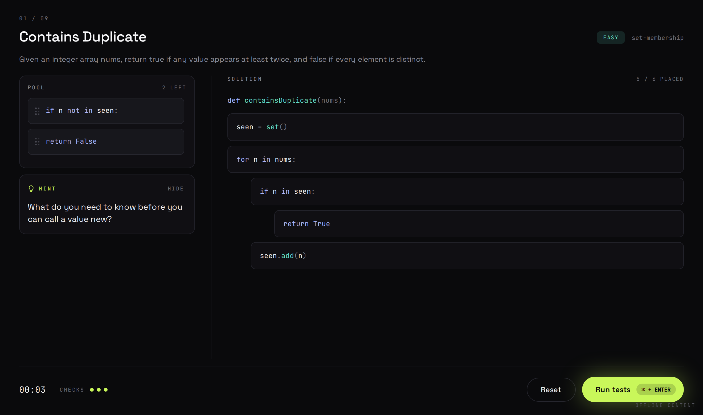
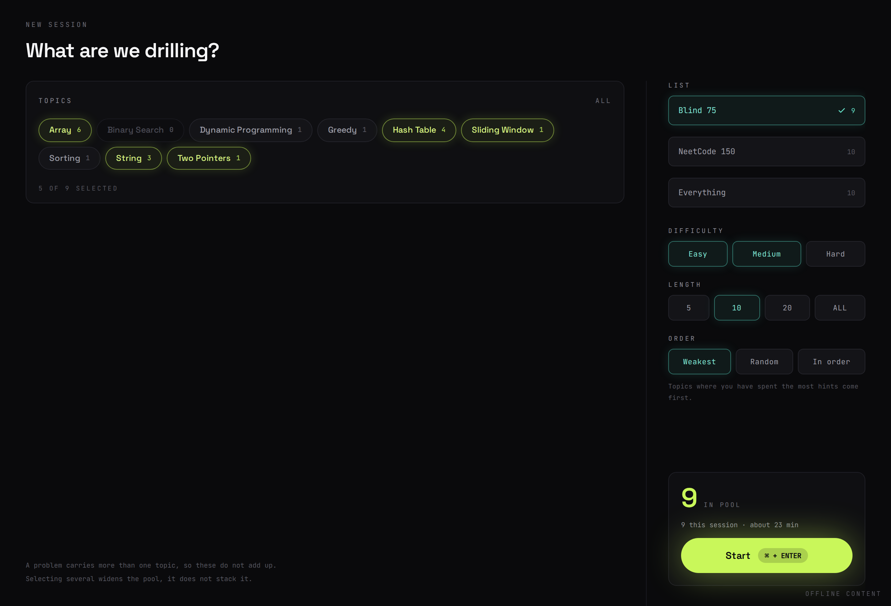

# Parsons

Reassemble shuffled code blocks into a working solution. The drill trains the
mapping from problem statement to algorithm skeleton, which is the thing that
makes LeetCode feel easy or impossible.



Blocks carry their own indent level, so whether a line sits inside or outside
the loop is part of the answer. Two of the blocks in that pool are distractors
and nothing on screen says which.



## Run it

```bash
pnpm install
pnpm --filter @parsons/shared build
pnpm dev
```

Open http://localhost:5173. The app falls back to the bundled content file when
no API is reachable, so this is enough to use it.

Python runs in the browser through Pyodide, loaded from a CDN on first use, so
the first `Run tests` needs a connection. After that it is cached.

## With the database

```bash
pnpm db:up      # postgres in docker
pnpm db:push    # create the tables from the drizzle schema
pnpm db:seed    # load content/problems.json
pnpm dev:api    # fastify on :3001
pnpm dev        # vite on :5173, in another terminal
```

The web app switches from bundled content to the API automatically. Attempts and
hint uses are only recorded when the API is up, and `Order · Weakest` only means
anything once they are.

## Layout

```
packages/shared     types, zod schemas, and every pure rule
apps/web            react + vite, drag and drop, pyodide
apps/api            fastify + drizzle + postgres
tools/pipeline      python: chunking and distractor generation
tools/sync          python: turns your GitHub solutions into problems
tools/verify        cross-checks the two assemblers agree
content/            generated problems.json (+ synced.json, gitignored)
```

Tuning values live in one constants file per area rather than inline:
`packages/shared/src/constants.ts`, `apps/web/src/constants.ts`,
`apps/api/src/constants.ts`, `tools/pipeline/constants.py` and
`tools/sync/sync_constants.py`. Colours are in `apps/web/src/theme.ts`.

`packages/shared` is the spine. `Problem` is defined once there, so a change to
the shape breaks compilation on both sides instead of at runtime.

## Adding problems

Add an entry to `tools/pipeline/solutions.py` with a canonical solution, a
handful of tests, and a hint, then:

```bash
pnpm content
pnpm verify
pnpm db:seed
```

Chunk boundaries and distractors are derived, not written. The chunker cuts on
statement boundaries and groups the leading run of simple statements in each
block. Distractors come from mutating the AST — flipping a comparison, dropping
a `+ 1`, swapping `min` for `max`, exchanging two variables — so a distractor is
always a near-miss of real code rather than something invented.

`pnpm content` refuses to write a problem whose chunks no longer reassemble into
code that passes its own tests. `pnpm verify` then re-runs every problem through
the TypeScript assembler to confirm the web app and the pipeline agree.

The hint is the one field you write by hand. One question, twelve words or
fewer, aimed at the ordering decision, naming no block. If reading it makes the
answer obvious it is too strong.

## Your own solutions

`tools/sync` pulls [your LeetHub repo](https://github.com/IvanHua2004/leetcode-solutions)
and turns every solution it can verify into a problem under **My solutions**.

```bash
pnpm sync            # one pass
pnpm sync -- -v      # ...and say why each skipped problem was skipped
pnpm sync:watch      # one pass now, then every 30 minutes
```

`pnpm dev` does the same in the background: it syncs on start and every 30
minutes while the dev server runs (`PARSONS_SYNC=off` to disable,
`PARSONS_SYNC_MINUTES=10` to change the interval). New problems show up the next
time the page loads. If Postgres is up, the sync reseeds it too.

For each `NNNN-slug/` folder, the README's examples become the tests. Your
solution has to pass them as written before anything else happens. The
`class Solution` method then becomes a plain function and gets chunked like
the curated set, and the reassembled blocks are run again. Distractors are
kept only if swapping one in makes a test fail. Anything that can't be checked
from JSON in, JSON out is skipped and reported, never guessed at. That covers
trees, linked lists, design classes, SQL, "any order" answers, and solutions
that use `self.helper()`.

Hints aren't generated. Synced problems show no hint button until you add one
in `content/synced-overrides.json`, which can also fix topics or add tests:

```json
{
  "two-sum": { "hint": "What value would finish the pair?", "topics": ["Array", "Hash Table"] },
  "merge-intervals": { "tests": [{ "args": [[[1, 4], [4, 5]]], "expected": [[1, 5]] }] },
  "fizz-buzz": { "skip": true }
}
```

Set `PARSONS_PYTHON` if Python isn't on your PATH as `py`, `python` or `python3`.

## Deploying

`.github/workflows/deploy.yml` (repo root) builds the app as a static site
and publishes it to GitHub Pages. It runs on every push to `main`, and every
30 minutes it checks the solutions repo, redeploying only when something new
was pushed. The static build has no API, so attempts aren't recorded there.
Use the local setup for the `Weakest` ordering.

One-time setup: **Settings → Pages → Build and deployment → Source: GitHub Actions**.

## Rules worth not breaking

Distractor blocks look exactly like real ones. Nothing in the UI marks them.

A failed check shows the failing input and what came back, never which block is
wrong. Finding that is the skill being trained.

There is no reveal button. Three checks, then the problem is failed and goes
back in the queue.

Execution stays in the browser. The server stores data and never runs user code,
which keeps sandboxing out of the project entirely.
